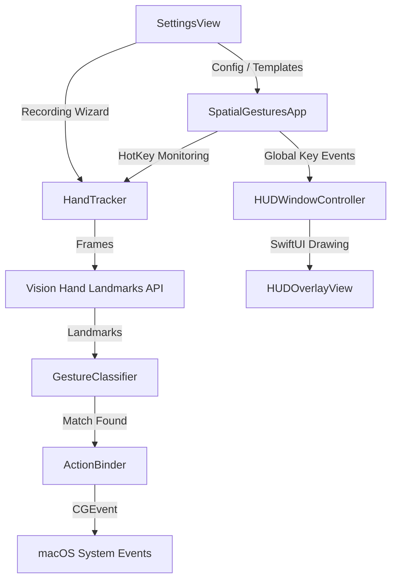

# Technical Implementation Plan: SpatialGestures

This plan outlines the sequential implementation stages for SpatialGestures. Each phase contains verification criteria to ensure code stability.

---

## 1. Component Architecture & Dependencies

*   **HandTracker:** Manages camera frames via `AVFoundation` and processes them via `Vision`.
*   **GestureClassifier:** Analyzes raw landmarks, performs normalization, and runs Euclidean similarity checks.
*   **ActionBinder:** Simulates key events and scrolls via CoreGraphics.
*   **HUDWindowController & OverlayView:** Transparent, click-through AppKit window that renders SwiftUI neon wireframes.
*   **SettingsView:** Configuration dashboard and training wizard.

---

## 2. Implementation Order

We will build the application in 6 sequential phases, ensuring that logic is fully tested before adding UI components.

### Phase A: Setup & Model Layer
1.  Initialize Swift Package Manager executable.
2.  Define `Package.swift` with dependencies.
3.  Implement `GestureTemplate` model (JSON Codable).
4.  Implement vector mathematics (distance calculations, centering, scale normalization).
5.  *Verification:* Write and run unit tests for JSON serialization and vector math.

### Phase B: Core Logic (Tracking & Classifier)
1.  Implement `HandTracker` using `AVCaptureSession` and `AVCaptureVideoDataOutput`.
2.  Implement `GestureClassifier` class with basic template-matching heuristics.
3.  Add camera access permission checking utility.
4.  *Verification:* Standard Swift test asserting mock landmarks classify correctly.

### Phase C: Global Key Interception & App Lifecycle
1.  Set up the `@main` App struct with `MenuBarExtra`.
2.  Implement global key monitoring using `NSEvent.addGlobalMonitorForEvents(matching:options:handler:)` for the hotkey toggles (e.g. `Option` or `Control`).
3.  Wire the hotkey to start/stop the `AVCaptureSession` instantly.
4.  *Verification:* Launch app, hold hotkey, observe system camera indicator lighting up immediately (<200ms) and turning off on release.

### Phase D: Transparent Overlay HUD
1.  Create `HUDWindowController` configuring an `NSWindow` to be borderless, transparent, non-interactive (click-through), and layered above all other windows.
2.  Create `HUDOverlayView` in SwiftUI to draw lines and points using raw joints data.
3.  *Verification:* Verify skeleton overlay tracks hand movement smoothly on screen.

### Phase E: Event Simulation (ActionBinder)
1.  Implement `ActionBinder` to generate scroll events and keystroke events.
2.  Map default swipe/wave gestures to actions (scroll up/down, workspace swap left/right).
3.  *Verification:* Move hand up/down while holding hotkey, verify active browser scrolls smoothly.

### Phase F: Settings UI & Training Wizard
1.  Implement settings dashboard in SwiftUI.
2.  Design and implement the **Custom Gesture Recording Wizard**:
    *   3-second countdown.
    *   Capture landmark frames over 2 seconds.
    *   Perform averaging to create a single clean reference vector.
    *   Save and map it.
3.  *Verification:* Successfully record a custom "Thumb Pose", map it to "Mute System", verify it activates and works in daily usage.

---

## 3. Risk & Mitigation Matrix

| Risk | Impact | Mitigation Strategy |
| :--- | :--- | :--- |
| **Fn Key Global Interception** | High | macOS has restrictions on monitoring the Fn key. We will support Option or Control as fallback hotkeys, which are fully supported globally via standard `NSEvent` modifier monitors. |
| **Camera Startup Latency** | High | Launching an `AVCaptureSession` can take 0.5s. If needed, we will keep the session running but disable data flow (or drop frames) when not active, reducing activation latency to < 50ms. |
| **Vision Battery Drain** | Medium | Vision runs on the Neural Engine. By restricting active tracking only to when the hotkey is held, we reduce CPU usage to near 0% when idling. |
| **SPM App Capabilities** | Medium | Standard SPM packages sometimes lack capabilities for sandbox permissions. If required, we will build a shell script to generate a temporary `.app` bundle structure with `Info.plist` to request camera permissions correctly. |

---

## 4. Parallel vs. Sequential Track
*   **Sequential:** Core tracker logic and `AVCaptureSession` lifecycle must be completed before visual overlays can be drawn.
*   **Parallel:** The `SettingsView` UI and the `ActionBinder` event simulation code can be developed and tested in isolation once the model definitions are complete.

---

## 5. Verification Gateways
*   **Gate 1:** Core models, math libraries, and classifiers pass 100% of unit tests.
*   **Gate 2:** Capture session launches and tears down in < 200ms during manual testing.
*   **Gate 3:** The transparent overlay render loop stays at 60fps without lagging user input.
*   **Gate 4:** Stored gestures correctly trigger simulated inputs in sandbox.
